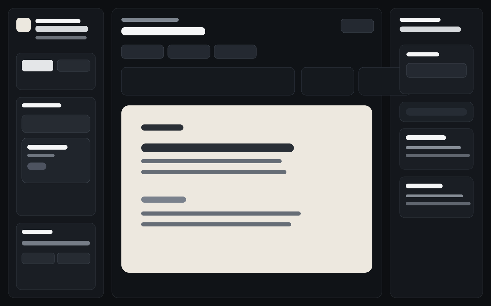

# Vellum Atelier

Vellum Atelier is a local-first academic writing web app designed for doctoral-level research writing in university contexts.

It aims to feel calm, trustworthy, and practical for long-form research work without locking the writer into one operating system or one storage vendor.



## For doctoral researchers

- doctoral researchers drafting articles, dissertation chapters, research plans, and literature reviews
- researchers preparing conference papers, funding outlines, and supervisor meetings
- academic writers who want local-first drafting with optional source search and repository-backed versioning

## What it does

- write in a document-style editor with formatting controls
- manage multiple drafts and folders
- autosave locally in the browser
- export a Word-compatible `.doc` file with project metadata, abstract structure, and bibliography
- export and import full project backups as `.json`
- suggest citations and reading based on the current draft
- generate and maintain a bibliography section automatically
- search OpenAlex and Zotero for relevant sources
- keep project snapshots in a GitHub repository
- track project metadata, literature matrices, revision tasks, and supervisor notes

## Local-first by default

Vellum Atelier treats the browser as the writer's working desk.

- drafting works locally first
- backups are explicit
- sync is optional
- temporary tokens are session-only
- the writing surface stays usable even when network-backed features are unavailable

## Run locally

Vellum Atelier is a static web app. Serve the repository over HTTP for the best experience:

```bash
python3 -m http.server 4180
```

Then open:

```text
http://127.0.0.1:4180
```

The optional GitHub sync helper can run alongside the app:

```bash
node server/sync-server.cjs
```

## Basic use

1. Open the app in a browser.
2. Write in the editor and organize drafts in folders.
3. Use the right-side panels for focus detection, source suggestions, review checks, and revision help.
4. Export a JSON backup before large changes or device moves.
5. Connect GitHub if you want repository-backed snapshots.

## Suggested PhD workflows

- dissertation chapter drafting with local notes, source tracking, and export
- journal article drafting with citation support and contribution/method checks
- literature review work with the built-in matrix for argument, method, evidence, and gap notes
- research plans and funding outlines with working title, deadline, target venue, and keyword metadata
- supervisor meetings with notes, questions, revision tasks, and an exportable supervisor copy

## Privacy and institutional use

Vellum Atelier is not an official Aalto University service unless it is separately deployed or approved by the institution.

Vellum Atelier is local-first.

- Drafts are autosaved in your browser using `localStorage`.
- Browser `localStorage` is not encrypted.
- GitHub tokens and private Zotero API keys are kept only for the current browser session and are not stored permanently in `localStorage`.
- Do not use saved project data or temporary tokens on shared or public computers.
- Do not enter confidential, personal, sensitive, unpublished, or restricted research data into third-party APIs unless that use is permitted by your institution and your project conditions.
- GitHub sync sends project data to the repository you choose.
- Zotero search contacts Zotero's API when you search your library.
- OpenAlex search contacts OpenAlex when you run academic metadata searches.
- Exported JSON files, Word-compatible exports, and GitHub snapshot files may contain sensitive draft content, notes, references, and project structure.

### Where data is stored

- project autosave: browser `localStorage`
- temporary GitHub and Zotero secrets: browser `sessionStorage`
- optional repository snapshot: `github-export/project-state.json` in the linked GitHub repository
- manual backups: exported `.json` and `.doc` files downloaded by the browser

## GitHub sync

There are two sync modes:

1. **Browser sync**
   - add a fine-grained GitHub token with `Contents` access
   - useful for cross-device pull/push from the browser
   - token stays only for the current session

2. **Local helper**
   - run `node server/sync-server.cjs`
   - useful when you want local Git to commit and push snapshots from this machine
   - the helper can write files, commit changes, and push them to the configured repository

This makes GitHub a storage and versioning layer, not a requirement for everyday writing.

## Zotero

Zotero support can search either a user library or a group library.

- public libraries: library ID only
- private libraries: library ID plus API key
- private API keys remain session-only

Zotero is there to support source retrieval and citation work without forcing the app to become a full reference manager.

## Browser compatibility

Best tested targets for the current prototype:

- latest Chrome
- latest Edge
- latest Safari
- latest Firefox

The app relies on modern browser features such as modules, `contenteditable`, `fetch`, `localStorage`, `sessionStorage`, and service workers. If those features are disabled, some parts of the app will degrade or stop working.

## Keyboard shortcuts

- `Cmd/Ctrl + K` — open quick actions
- `Escape` — close menus, palette, or context menu

## Project structure

```text
assets/            Static assets
docs/              Project docs and screenshots
server/            Optional local sync helper
src/               App code and data modules
styles/            App stylesheet
github-export/     Snapshot output used by GitHub sync
index.html         App shell
service-worker.js  Offline cache layer
manifest.webmanifest
```

## Known limitations

- the current Word export is a Word-compatible `.doc`, not a true `.docx`
- citation formatting is practical rather than fully CSL-complete
- similarity checks are writing aids, not formal plagiarism reports
- GitHub sync does not do collaborative merge resolution inside the app yet
- the supervisor workflow is intentionally lightweight and does not replace institutional supervision systems

## Manual test checklist

1. Open the app and confirm the default workspace feels writing-first, with project tools tucked behind disclosures.
2. Refresh the page and confirm drafts restore from browser autosave.
3. Enter a GitHub token, reload, and confirm the token is gone while the repository URL remains.
4. Enter a Zotero API key, reload, and confirm the key is gone while the library ID remains.
5. Export JSON, import it back, and confirm the project restores without crashing.
6. Fill in project metadata and confirm it survives refresh and appears in export.
7. Add a few literature matrix rows and confirm status, argument, method, evidence, and gap fields persist.
8. Add supervisor notes, questions, and revision tasks, then export a supervisor copy.
9. Open Project tools and confirm export, import, GitHub, and session-token actions still work.
10. Click Clear local data and confirm the workspace resets only after confirmation.

## Development notes

- keep privacy-sensitive changes mirrored in `README.md` and `PROJECT_STATUS.md`
- prefer updating storage and sync code together when changing persistence behavior
- keep backup/import/export formats versioned for future migration work
